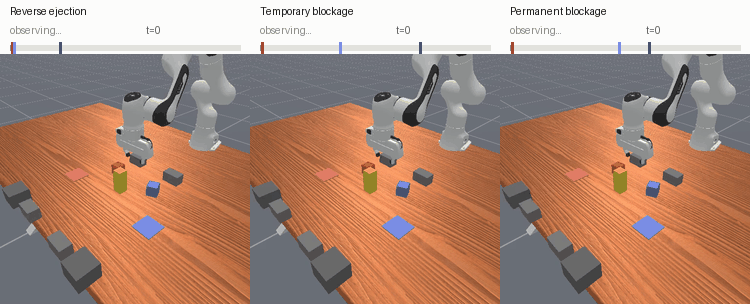
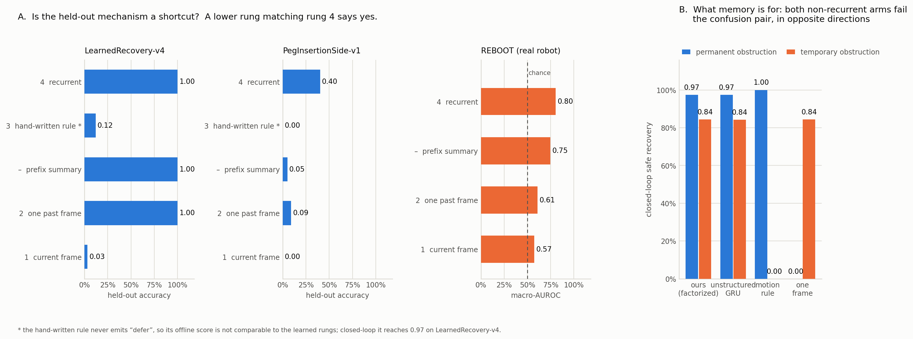

# Adaptive Task Recovery

A robot is part-way through a task when the world changes in a way it cannot
undo. An object is knocked out of reach. A goal gets blocked. Something drops
into the workspace that may or may not move again. The robot has to work out
which of its goals are still achievable, finish those, and leave alone what it
was told not to touch.

This repository contains a simulated benchmark for that problem, an audit that
checks whether such a benchmark measures what it claims to, and the full record
of what the audit found — including the parts that went against us.

<p align="center">
  
</p>

<p align="center"><sub>
One controller, three mechanisms. It commits to a response almost immediately
when a cube is ejected, but observes for tens of steps before committing when a
goal is blocked — because a blockage that will clear and one that will not look
identical when they first appear. The outcome line separates them: the two
irreversible mechanisms end with one cube placed and one permanently gone,
while the reversible one ends with both placed.
</sub></p>

## The problem underneath the problem

Building a recovery benchmark is easy. Building one that actually measures
recovery is not, and the failure is quiet.

The usual design holds out a failure mechanism the model never trains on, then
asks whether it can compose an appropriate response. A large margin over a
learned baseline reads as evidence that it can. That inference is only valid if
the held-out mechanism cannot be identified by something lacking the capability
being tested — and checking that is not standard practice.

It should be. When we checked our own benchmark, a model seeing a single past
frame, with no memory and no sequence encoder, identified the held-out mechanism
as accurately as the recurrent model did.

## The control ladder

The audit scores a benchmark's held-out mechanism against four controls of
increasing capability, on identical inputs, splits and targets:

| Rung | Control | The question it answers |
|---|---|---|
| 1 | the current frame only | is the mechanism visible instantaneously? |
| 2 | one earlier frame | is it visible from a single past observation? |
| 2b | an order-free summary of the prefix | is it visible without temporal order? |
| 3 | a hand-written motion threshold | is it visible to a rule with no learning? |
| 4 | a recurrent model | does identifying it require temporal evidence at all? |

A lower rung **matches** rung 4 when the paired bootstrap interval on their
difference includes zero — resampling whole episodes for the simulated
benchmarks and object families for recorded trajectory data, pooling every
training seed. If a lower rung matches, the held-out mechanism is a shortcut,
and no composition claim follows from it however large the margin over a weak
baseline looked.

<p align="center">
  
</p>

## What it found

Run on three benchmarks with an identical rung set:

| Benchmark | Best lower rung | Rung 4 | Difference | Verdict |
|---|---:|---:|---|:---:|
| `LearnedRecovery-v4` — ours, two-cube tabletop | 1.0000 | 1.0000 | +0.0000 [0.0000, 0.0000] | shortcut |
| `PegInsertionSide-v1` — contact-rich insertion | 0.0909 | 0.4015 | +0.3240 [0.1344, 0.5231] | none |
| Recorded real-robot trajectories, ten seeds | 0.7482 | 0.8108 | +0.0626 [0.0035, 0.1367] | none |

One positive, two negatives. The audit discriminates rather than firing
everywhere, which is what makes the positive worth reading.

That positive has a specific and slightly embarrassing cause. Our two ejection
directions were produced by *separate actors* — a forward pusher and a reverse
pusher — so identifying the mechanism reduced to noticing which one had moved.
A hand-written threshold reaches 97.40% closed-loop doing exactly that.

Here is the whole closed-loop benchmark, every arm on identical inputs. It is
worth reading across rather than down: the rule in the third-to-last row is the
finding, not the winner.

| Arm | Recurrent | n | Safe success | Violations | permanent | temporary | held-out reverse |
|---|:---:|---:|---:|---:|---:|---:|---:|
| Factorized router (matched inputs) | yes | 2,880 | 88.99% | 0.83% | 97.40% | 84.38% | 97.40% |
| Unstructured recurrent | yes | 2,880 | 81.74% | 4.83% | 97.40% | 84.20% | 46.88% |
| Hand-written motion rule | no | 960 | 74.06% | 16.98% | 100.00% | 0.00% | 97.40% |
| One past frame | no | 2,880 | 70.90% | 0.83% | 0.00% | 84.38% | 97.40% |
| Current frame only | no | 2,880 | 0.00% | 0.00% | 0.00% | 0.00% | 0.00% |
| Immediate oracle (privileged) | — | 960 | 89.79% | 1.87% | 99.48% | 76.04% | 90.10% |
| Factorized router + sweep dispatch | yes | 2,880 | 92.19% | 0.83% | 97.40% | 84.38% | 97.40% |

A rule with no learning matches the recurrent models on the held-out mechanism
(97.40%) and beats them outright on permanent blockage (100%). It pays for that
with a 16.98% violation rate — it acts confidently and is often wrong about what
it is allowed to touch — but a benchmark where the held-out column can be topped
without learning is not measuring what it advertises. The privileged oracle,
which is told the mechanism outright, is statistically indistinguishable from
the router that has to infer it (−0.80 points, [−2.93, +1.55]).

Two rows need caveats, because the table flatters us without them. The
**current-frame arm scores 0.00% by construction, not by finding**:
current-centering forces the final geometry frame to exactly zero, so that arm
is handed an all-zero vector. It cannot separate "history is required" from
"this arm was given nothing", and a fair version would train on a non-final
frame. And the **last row is unmatched** — the sweep dispatch it uses is
available to no other arm, which is why the matched 88.99% is the number the
comparison rests on.

Worse, we had already fixed a shortcut here once. An earlier version leaked the
mechanism through instantaneous geometry, so we re-expressed every frame as a
displacement relative to the present. That worked: rung 1 falls to 0.0322. But
because every frame now carried a signed displacement, a single early frame
carried the whole answer instead. **Closing one leak opened a subtler one a rung
up**, and only a ladder of controls makes that visible.

### Which capability needs memory is not stable across benchmarks

On our benchmark, telling a permanent obstruction from a temporary one genuinely
requires temporal evidence. Both non-recurrent controls fail that pair in
*opposite* directions, each solving one side and scoring zero on the other,
while both recurrent models solve both.

On the contact-rich task it reverses. There the memoryless control is the
strongest arm on permanent blockage. The same four arms, with that task set
beside the two columns from the table above:

| Arm | ours: permanent | ours: temporary | contact-rich: permanent |
|---|---:|---:|---:|
| Recurrent, factorized | 0.9740 | 0.8438 | 0.4740 |
| Recurrent, unstructured | 0.9740 | 0.8420 | 0.5208 |
| One past frame | 0.0000 | 0.8438 | **0.5677** |
| Hand-written rule | 1.0000 | 0.0000 | 0.0000 |

So "temporal evidence is needed to judge persistence" is a property of the
benchmark it was measured on, not a fact about recovery.

### A benchmark can leak through its clock

The contact-rich task's features are expressed relative to the present, which
should leave a single-frame model with almost nothing. It nonetheless scored
0.80 and 0.84 on the two blockage conditions. The remaining input was elapsed
time.

Zeroing that one feature and changing nothing else:

| Model | Condition | With time | Without | Change |
|---|---|---:|---:|---:|
| Single frame | permanent blockage | 0.8034 | 0.6094 | **−0.1940** |
| Single frame | temporary blockage | 0.8424 | 0.6027 | **−0.2398** |
| Single frame | ejection | 0.6033 | 0.6071 | +0.0038 |
| Recurrent | permanent blockage | 0.7362 | 0.7468 | +0.0106 |

The effect lands on the two blockage conditions and nowhere else, and the
recurrent model is untouched. Mechanisms that end episodes at different times
produce different duration distributions, so an elapsed-time feature encodes
which mechanism fired. **Any recovery benchmark carrying one should ablate it.**

## A separate thread: control from restricted vision

Everything above reads privileged state. A parallel line asked whether the same
recovery behaviour survives when the deployed policy has to look at the scene
instead. The controller executes continuous joint control from RGB, robot
proprioception, and the instruction. Object poses, intervention labels, and
evaluator domains are not available to it at deployment.

Its gate was frozen in advance and ranked candidates on the **minimum** of four
endpoints rather than their mean, so a policy could not average away a weak
regime. Across three seeds and 768 held-out episodes per regime:

| Regime | Safe success | Violations |
|---|---:|---:|
| Strict physical removal | 96.35% | 1.30% |
| Nominal two-goal task | 91.41% | 3.65% |
| First goal removed | 97.06% | — |
| Second goal removed | 95.69% | — |

It passes, at a 91.41% worst endpoint against a 90% floor. The honest framing is
narrow: training uses two privileged specialists and a training-only label to
route supervision, so this is expert distillation with PPO under privileged
training, **not** pixel RL and not a self-supervision result. Only deployment is
restricted.

The useful finding here is a failure. A variant with full-strength
anti-collapse self-supervision learned measurably *better* representations —
matched-pixel pose R² +0.0106 [0.0016, 0.0212], task-semantic R² +0.0146 [0.0010,
0.0377], both intervals excluding zero — and controlled measurably *worse*:
85.42% strict, and 74.06% on the first-removal branch against 97.06%. A narrower
follow-up that changed only the variance coefficient was also rejected, at
87.63% strict and 78.34% first-removal.

So improved linear decodability of the state did not transfer to control, and
twice moved against it. Representation probes are not a proxy for competence
here, and a selector reading probe quality would have picked the worse policy
both times. The frozen record is
[`results/gates/integrated_visual_selection_v6.json`](results/gates/integrated_visual_selection_v6.json).

## What this does and does not establish

The audit is the contribution, and it holds: a reusable procedure with a
statistical criterion, validated by returning different verdicts on benchmarks
that look equivalent by construction.

The recovery architecture is reported as a **negative result**. On recorded
real-robot trajectories it is statistically indistinguishable from a
capacity-matched plain recurrent model (−0.0021, interval [−0.0123, +0.0069],
ten seeds). On the benchmark without a shortcut it reaches 0.0199 on genuinely
observed held-out prefixes.

The restricted-vision result stands on its own gate and does not carry over to
the audit: it was frozen as a post-hoc extension and explicitly cannot revise
any preregistered verdict above. It also runs in the same environment family the
audit flagged, so it inherits that family's ease — it shows a vision-deployed
policy clearing a preregistered bar on goal removal, not that the underlying
task is hard.

Two preregistered gates were frozen before the runs they scored, and both
failed; both are kept as results rather than removed. A continuation intended to
strengthen the nominal controller failed all four checks and *degraded*
competence. A redesigned environment intended to remove the actor-identity
shortcut failed three of four physics checks — the idea was right, the
implementation did not produce the motion it was supposed to.

Full detail, including a verdict that changed three times as the audit was
corrected, is in
[`docs/30-recovery-audit-protocol.md`](docs/30-recovery-audit-protocol.md).

## Limitations

Stated here rather than buried, because they bound everything above.

The task is easy. Five-centimetre cubes onto nine-centimetre pads with a
four-centimetre tolerance and no orientation requirement; the same
pick-and-place primitive reaches 98.31% elsewhere in this repository. The
tolerance is loose enough to be visually ambiguous — a cube counted as placed
can overhang the edge of its pad.

Interventions are scripted exogenous events at a fixed step, so recovery here
means recognising a goal is gone and completing the rest. That is goal
filtering, not recovery from the robot's own execution failure. We tried to
replace them with emergent failures and found the nominal controller's own
failures to be 98.8% a single mode — not enough variety to route over.

All closed-loop control is simulated. The real-robot evidence is offline
inference on recorded trajectories.

Only the benchmark we built flags. The contact-rich task and the external
trajectories do not, so the evidence supports a claim about how a benchmark of
this construction leaks, not a claim about the class.

[`docs/19-evidence-standards.md`](docs/19-evidence-standards.md) states the
standard a result must meet here before it is called established.

## Repository layout

```
src/atr/envs/        recovery environments, including the contact-rich extension
src/atr/policies/    routers, matched controls, and the hand-written baseline
scripts/             the audit, training, evaluation and figure pipelines
docs/                protocol, evidence standards, and the design record
ai-notes/            decision log, risks, and the living status tracker
configs/             frozen experiment configurations and their gates
results/             committed measurements cited by the documents above
tests/               contract tests for the environments and controls
```

Entry points worth knowing:

- [`scripts/audit_shortcut_ladder.py`](scripts/audit_shortcut_ladder.py) — the
  control ladder and its statistical criterion.
- [`scripts/plot_shortcut_ladder.py`](scripts/plot_shortcut_ladder.py) — renders
  the figure above from committed measurements.
- [`src/atr/policies/option_router.py`](src/atr/policies/option_router.py) — the
  recurrent models and the matched controls they are compared against.
- [`src/atr/policies/heuristic_option_router.py`](src/atr/policies/heuristic_option_router.py)
  — the hand-written rule, written over the same inputs so the comparison is
  fair.

## Getting started

```bash
pip install -e .
pytest tests -q --ignore=tests/drafts --ignore=tests/spikes
```

That runs the maintained contract tests for the environments, the routers and
the audit — 126 tests, about a minute and a half. `tests/drafts/` and
`tests/spikes/` hold the per-candidate tests written alongside experiments that
were later abandoned. They are kept as part of the record but are not
maintained: some expect a GPU or a checkpoint that is not in the repository and
will stall rather than fail, so do not include them in a routine run.

Training and closed-loop evaluation expect a GPU, and the checked-in Slurm
wrappers show the exact invocations used to produce every committed result.

Experiment configurations are immutable once frozen: seed families, thresholds
and checkpoint digests are recorded before a run and never edited afterwards.
Reserved seed families stay unopened until the work they gate is complete.

## Naming

Several numbering schemes accumulated during development and occasionally reuse
the same token for different things. A counter is not a quality ordering — a
higher number is a later attempt, not a better one, and most were rejected.
[`docs/31-naming-and-identifier-key.md`](docs/31-naming-and-identifier-key.md)
maps every counter to what it refers to.

## License

See [LICENSE](LICENSE).
