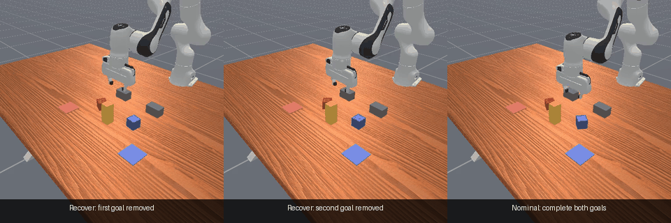

# Adaptive Task Recovery

When a robot is part-way through a task and the world changes irreversibly — an
object is knocked out of reach, a goal gets blocked, an obstruction appears that
may or may not clear — it has to work out which of its goals are still possible
and pursue those, without faking success. Adaptive Task Recovery (ATR) is a
benchmark and an audit for that problem.

## The idea

Building a recovery benchmark is easy. Building one that actually *measures*
recovery is not, because a benchmark can look hard while being solvable by
something trivial.

ATR's benchmark holds out a recovery mechanism the model never trains on, then
asks whether it can compose the right response. A large margin over a learned
baseline looked like evidence that it could. **It wasn't.** A model that sees a
single past frame — no memory, no sequence encoder — identifies the held-out
mechanism perfectly.

So we built a **shortcut ladder**: score the held-out mechanism against four
controls of increasing capability on the identical inputs, split, and targets.

| Rung | Control | Question it answers |
|---|---|---|
| 1 | current frame only | is the mechanism visible instantaneously? |
| 2 | one past frame | …from a single earlier observation? |
| 3 | hand-written rule | …from a motion threshold with no learning? |
| 4 | recurrent model | does it need temporal evidence at all? |

**If a lower rung matches rung 4, the held-out mechanism is a shortcut** and no
composition claim survives, however large the margin over a weak baseline.

<p align="center">
  
</p>

Run on three benchmarks the ladder returns **one positive and two negatives**,
which is what makes it a method rather than an anecdote.

| Benchmark | Rung 2 | Rung 4 | Shortcut? |
|---|---:|---:|:---:|
| `LearnedRecovery-v4` (ours) | **1.0000** | 1.0000 | **yes** |
| `PegInsertionSide-v1` | 0.0909 | 0.4015 | no |
| REBOOT — real robot, another group | 0.6080 | 0.8045 | no |

REBOOT is the negative control that matters: 2,072 real-robot trajectories
across nine leave-one-object-out families, collected by someone else. There the
endpoint-pair control reaches only **0.6080** macro-AUROC against 0.80 for the
recurrent model — a gap of **+0.1966 [+0.1557, +0.2357]**. The held-out object
family is genuinely not identifiable without temporal structure, so the audit
does not simply fire everywhere.

**The design lesson is specific.** Current-centering was introduced to remove an
earlier shortcut in which instantaneous geometry gave the mechanism away, and it
worked — rung 1 drops to 0.03. But because centering expresses every frame as a
signed displacement to the present, it *created* a rung-2 shortcut where one old
frame carries the whole answer. Fixing a leakage path at one rung opened a
subtler one at the next, and only the ladder exposes it.

**What memory is actually for** (panel B) is narrower than it looked: deciding
whether an obstruction is permanent or temporary, where committing early to the
wrong side is unrecoverable. The two non-recurrent arms fail that pair in
*opposite* directions — the rule calls everything permanent, the one-frame model
calls everything temporary — and both recurrent arms solve both. Mechanism
identification needs no memory; persistence disambiguation does.

## The task family

<p align="center">
  
</p>

<p align="center"><sub>
What an irreversible change looks like. These are recordings of the earlier
restricted-RGB controller on <code>LearnedRecovery-v3</code>, seed 4796, at
96,657,408 steps: one frozen policy across both removal orderings and a nominal
two-goal episode, force-driven interventions, zero teleport calls.
<b>They are illustrative of the problem, not of the results above.</b> The
ladder and the confusion-pair findings use <code>LearnedRecovery-v4</code>,
which adds permanent and temporary blockage and reverse ejection — mechanisms
this footage does not contain — and a router rather than this controller.
</sub></p>

Runtime routing is temporally causal — it reads only observations at or before
the current step — and excludes intervention identity, future state, oracle
feasibility, and native success labels. "Causal" throughout this repository
refers to that no-future-access property, **not** to inferring causal dynamics;
the history ablation below rejects the stronger reading.

## Results in detail

The numbers behind the figure above, plus the completed baseline set. Rejected
experiments, development sweeps, and historical results stay in the evidence
ledger rather than the README.

### Guarded factorized dispatch — untouched confirmation, completed baselines

The guarded factorized dispatch router was frozen before its once-only
`347000000` confirmation family was opened. Evaluation uses three policy lineages, five recovery
conditions, matched observations and specialists across routers, and a held-out
reverse-ejection mechanism.

The gate's declared method list includes a hand-written motion-threshold router
and an oracle upper bound. Both were unimplemented when the gate was first scored,
so the original comparison ran three arms rather than five. Both are now built
and evaluated on the same family; the table below is the completed comparison.

The causal arm additionally ran a factorized sweep dispatch that no other arm
can execute. It is reported separately rather than folded in, because only one
arm could receive it.

| Arm | Recurrent | n | Safe | Viol | permanent | temporary | held-out reverse |
|---|:---:|---:|---:|---:|---:|---:|---:|
| **Causal router (matched)** | yes | 2,880 | **88.99%** | **0.83%** | 97.40% | 84.38% | 97.40% |
| Unstructured GRU | yes | 2,880 | 81.74% | 4.83% | 97.40% | 84.20% | 46.88% |
| Hand-written motion rule | no | 960 | 74.06% | 16.98% | **100.0%** | **0.00%** | 97.40% |
| Static offset, one frame | no | 2,880 | 70.90% | 0.83% | **0.00%** | **84.38%** | 97.40% |
| Static MLP, current frame | no | 2,880 | 0.00% | 0.00% | 0.00% | 0.00% | 0.00% |
| Immediate oracle (privileged) | — | 960 | 89.79% | 1.87% | 99.48% | 76.04% | 90.10% |
| *Causal + factorized dispatch* | yes | *2,880* | *92.19%* | *0.83%* | *97.40%* | *84.38%* | *97.40%* |

Matched-input gains, Newcombe 95%: **+7.26 points [+5.44, +9.07]** over the
unstructured GRU and **+14.93 points [+12.00, +18.00]** over the heuristic. The
causal router is statistically indistinguishable from the privileged immediate
oracle (**−0.80 points [−2.93, +1.55]**) while using no privileged input.

**What actually requires memory.** Mechanism *identification* requires none.
The held-out reverse ejection is solved at an identical **97.40%** by the causal
router, the hand-written threshold rule, and a single-observation MLP with no
sequence encoder at all — three independent methods, one of them memoryless.
Only the unstructured GRU fails it (46.88%). A held-out mechanism that a
one-frame model identifies perfectly cannot support a composition claim.

The discrimination lives entirely in one confusion pair: **permanent versus
temporary obstruction**, where a wrong commitment is unrecoverable. Both
non-recurrent arms fail it in *opposite* directions — the threshold rule calls
everything permanent (100.0% / 0.00%), the one-frame model calls everything
temporary (0.00% / 84.38%). Each solves one side and scores zero on the other.
Both recurrent arms solve both. Against the one-frame model the causal router
gains **+97.40 points [+95.62, +98.42]** on permanent blockage while being
statistically identical on nominal, temporary, and held-out reverse, and
*worse* on forward ejection (−7.12 points).

The supported claim is therefore narrow and mechanistic: **temporal evidence is
required to defer commitment on an obstruction whose persistence is not yet
observable, and for nothing else in this benchmark.**

The static MLP's 0.00% is structural, not a defeated baseline: current-centering
makes the final geometry frame exactly zero (audited, `final_geometry_max_abs =
0.0`), so a model that sees only that frame receives an all-zero input. The
`static offset` arm replaces it with a real single-observation control that
reads one earlier frame; offline it reaches **100%** held-out reverse accuracy,
selected across 16-, 48-, and earliest-frame offsets by validation only.

Two ablations constrain the mechanism further. Reversing the prefix in time
leaves held-out accuracy at **97.7% / 77.6% / 96.9%**, so temporal *direction*
is not used. And stripping history from a history-trained model drops it to
**0.000** — but that measures degradation under distribution shift, not
necessity, since a model *trained* on one frame reaches 100%. The supported
mechanism is temporal aggregation of signed motion evidence with deferred
commitment, not causal dynamics inference.

The same frozen controller passed the registered pooled OOD gate at
**6,369/7,680 — 82.93% safe recovery**, above its 75% floor, with **2.81%**
violations. This is a pooled result, not universal robustness: 12-step action
delay reached only 55.83% safe recovery, and a long temporary obstruction
produced 15.83% violations.

Authoritative records:
[`configs/temporal_composition_v10_confirmation.json`](configs/temporal_composition_v10_confirmation.json)
and [`results/router/matched_router_comparison_347M.json`](results/router/matched_router_comparison_347M.json).
The completed five-arm comparison and the history ablations are development
evidence on an already-opened family, not a second gate pass.

### REBOOT real-robot trajectories — leave-one-object-out transfer

The causal recovery-state predictor was evaluated offline on **2,072 usable
real-robot trajectories** from the 2026
[REBOOT benchmark](https://nanayawoa.github.io/REBOOT/). All models use matched
inputs and leave each of nine object families out in turn.

| Recovery-state predictor | Macro-AUROC |
|---|---:|
| Static MLP | 0.5797 |
| Trajectory-moment MLP | 0.7450 |
| Unstructured GRU | 0.8072 |
| **Causal dynamics GRU** | **0.8353** |

The causal model improves over the static model by **+25.56 AUROC points**
(object-bootstrap 95% interval **[+21.10, +29.47]**) and over the
trajectory-moment baseline by **+9.03 points** (**[+1.96, +18.08]**). Its
+2.82-point difference from the unstructured GRU is not statistically resolved
(**[−1.40, +9.38]**), so no architecture-superiority claim is made for that
comparison. This is real-robot offline inference, not real-robot closed-loop
control. The model name follows the simulator router's; the history-direction
ablation above was run on that router, not on this offline predictor, so no
causal-dynamics claim is made here either.

The control ladder was also run here, and it is the audit's negative control:
the endpoint-pair rung reaches 0.6080 against 0.8045 for the recurrent model,
**+0.1966 [+0.1557, +0.2357]**. This benchmark's held-out family genuinely
requires temporal structure.

Adding that rung exposed an order-dependent seeding defect: model weights were
initialised from the advancing global RNG, so inserting a method silently
re-initialised every method after it. `fit_one` now seeds per method and fold.
With that fixed the causal-versus-unstructured comparison is **−0.0067 [−0.0249,
+0.0119]**, still unresolved, consistent with the original run.

Authoritative records:
[`results/a_plus_audit/reboot_v2_aggregate.json`](results/a_plus_audit/reboot_v2_aggregate.json)
and [`results/a_plus_audit/reboot_ladder_v4_aggregate.json`](results/a_plus_audit/reboot_ladder_v4_aggregate.json).

### Restricted-RGB continuous recovery

The dual-specialist RGB controller is the strongest completed integrated
restricted-input policy. Across three seeds and 768 held-out episodes per
regime it reaches:

| Regime | Safe success | Violations |
|---|---:|---:|
| Strict physical removal | **96.35%** | 1.30% |
| Nominal two-goal task | **91.41%** | 3.65% |
| First goal removed | **97.06%** | included above |
| Second goal removed | **95.69%** | included above |

The actor executes continuous joint control from restricted RGB, robot
proprioception/TCP, the instruction, and learned progress. Object poses,
intervention labels, and evaluator domains are unavailable to the deployed
actor. Training uses privileged teachers and labels, so this is not a pure
self-supervised or end-to-end pixel-RL claim.

Evidence and claim boundaries:
[`docs/14-results-and-claim-boundaries.md`](docs/14-results-and-claim-boundaries.md)
and [`docs/17-visual-training-ledger.md`](docs/17-visual-training-ledger.md).

## Publication status

The completed custom-benchmark result and the REBOOT offline transfer are
strong positive evidence, but they are not sufficient for a top-tier claim. The
independently preregistered, no-teleport ManiSkill `PegInsertionSide-v1`
closed-loop gate is still in progress. Its reserved `425000000` selection and
`429000000` confirmation families remain unopened.

No running Peg result is reported above. Promotion requires all of the
following without relaxing thresholds after seeing outcomes:

1. three-seed official PegInsertion nominal competence;
2. input-matched causal routing that passes held-out-direction composition;
3. stronger closed-loop performance than static, unstructured recurrent, and
   heuristic routers with the same observations and specialists;
4. at least 80% safe recovery, at least 75% held-out-direction recovery, no
   more than 3% violations, and a significant gain of at least five points;
5. a once-only untouched `429000000` confirmation.

The complete protocol is in
[`docs/19-iros-publishability-gate.md`](docs/19-iros-publishability-gate.md)
and [`docs/30-a-plus-recovery-protocol.md`](docs/30-a-plus-recovery-protocol.md).

## Reproducibility

**Naming.** Prose here names methods by what they do. Version tags survive only
where they identify a frozen artifact — a registered environment (`LearnedRecovery-v4`),
a preregistered gate config, a checkpoint's persisted `model` string, or a
reserved seed family. Those are immutable identifiers with provenance attached,
not a quality ordering: a higher number is a later candidate, not a better one,
and most were rejected. The per-candidate ledger lives in
[`docs/30-a-plus-recovery-protocol.md`](docs/30-a-plus-recovery-protocol.md).

The repository records immutable experiment configurations, seed families,
checkpoint hashes, per-episode outcomes, confidence intervals, failed gates,
and Slurm job provenance. Runtime interventions use simulator forces and
contacts; pose assignment is permitted only during reset.

Key entry points:

- [`src/atr/envs/learned_recovery_v4.py`](src/atr/envs/learned_recovery_v4.py):
  mechanism-diverse custom recovery environment.
- [`src/atr/envs/peg_insertion_recovery.py`](src/atr/envs/peg_insertion_recovery.py):
  no-teleport extension of official ManiSkill PegInsertion.
- [`src/atr/policies/option_router.py`](src/atr/policies/option_router.py):
  learned factorized and matched-baseline router models.
- [`src/atr/policies/heuristic_option_router.py`](src/atr/policies/heuristic_option_router.py):
  hand-written motion-threshold baseline over the same matched tensor.
- [`scripts/evaluate_external_peg_router.py`](scripts/evaluate_external_peg_router.py):
  matched closed-loop external evaluation.
- [`scripts/summarize_external_peg_gate.py`](scripts/summarize_external_peg_gate.py):
  fail-closed external publication gate.
- [`scripts/audit_shortcut_ladder.py`](scripts/audit_shortcut_ladder.py): the
  four-rung shortcut audit, and
  [`scripts/plot_shortcut_ladder.py`](scripts/plot_shortcut_ladder.py) which
  renders the figure above from committed artifacts.
- [`docs/18-evidence-blueprint.md`](docs/18-evidence-blueprint.md): evidence
  provenance and claim boundaries.

Install the project in a Python environment with its simulator dependencies,
then run the non-GPU contract tests:

```bash
pip install -e .
pytest -q
```

GPU experiments are designed for Slurm and use the checked-in launch scripts.
Do not substitute development seeds for reserved confirmation families.

## Scope

ATR currently establishes simulation closed-loop recovery and offline transfer
on real-robot trajectories. It does **not** claim real-robot closed-loop
recovery, universal visual robustness, or an A/A+ general-method result before
the external PegInsertion gate passes.

Detailed negative results are intentionally retained in [`docs/`](docs/) and
[`results/`](results/) so that the concise README does not become selective
reporting.

## License

This project is licensed under the terms in [LICENSE](LICENSE).
