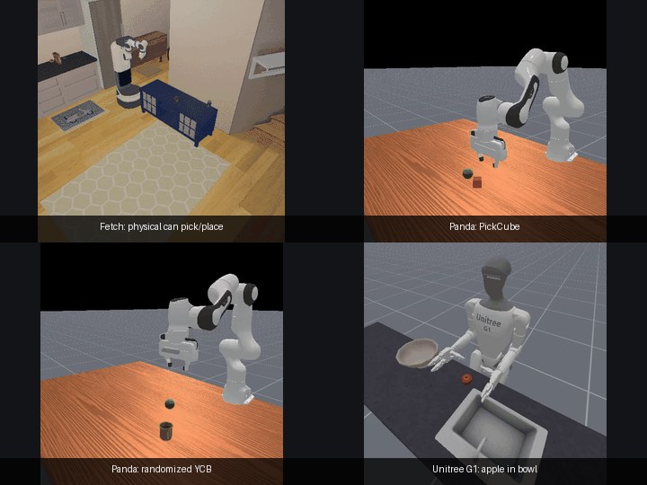
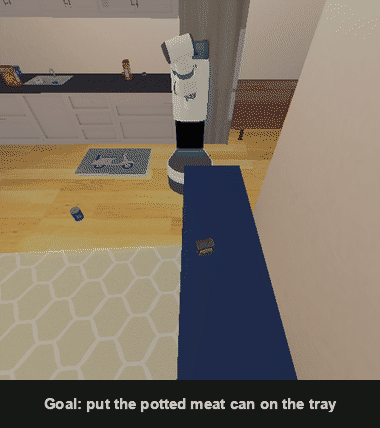

# Adaptive Task Recovery

Adaptive Task Recovery (ATR) is a research project about **intent-preserving
adaptation after irreversible world changes**. It studies whether a
vision-language reinforcement learning agent can use self-supervised visual
representations to determine which language-specified goals remain feasible and
revise its strategy to achieve as much of the original intent as possible.

  

  

Every panel is a real ManiSkill3 recording. The montage combines physical Fetch
pick/carry/place with frozen non-teleport PPO policies for PickCube, randomized
YCB, and G1 apple-in-bowl; the second recording shows collision-aware Fetch
replanning. See <a href="#what-this-project-does-not-claim">what this project
does not claim</a> for the boundary between these separately evaluated tracks.

## Research question

A robot gets an instruction with more than one goal. Partway through, the
world changes in a way that can't be undone — something breaks, disappears,
or a path closes. Can the robot tell which goals are still possible, still
do whichever of them remain achievable, and never fake success by doing
something it was never asked to do?

> Can a vision-language reinforcement learning agent, equipped with
> self-supervised visual representations, learn to identify which
> language-specified goals remain feasible after unforeseen and irreversible
> world changes, and adapt its task strategy to maximize goal achievement
> without violating the original intent?

See [`docs/00-project-overview.md`](docs/00-project-overview.md) for the
full breakdown, including the build-up order this project actually follows
(language, then vision, then self-supervised representations, then a
learned policy — one capability at a time, each checked before the next).

Examples include an object becoming unavailable, a container breaking, a route
becoming blocked, or a limited resource being consumed. These changes make the
original plan invalid and may make some goals impossible. The challenge is to
distinguish infeasibility from temporary difficulty, reason over multiple goals
and constraints, and choose an acceptable partial or alternative completion.

## Results

Five hypotheses, each with real evidence — paired seeds, bootstrap confidence
intervals, and real ManiSkill3 simulator episodes, not toy numbers. Full
detail and every underlying number is in
[`ai-notes/decisions.md`](ai-notes/decisions.md); the paper-facing result index
and claim boundaries are in
[`docs/14-results-and-claim-boundaries.md`](docs/14-results-and-claim-boundaries.md).

| | Hypothesis | Result |
|---|---|---|
| **H1** | A perceptual feasibility signal (not just privileged simulator state) is usable | **Confirmed.** Real zero-shot CLIP perception matches oracle behavior exactly on the project's own success-criteria benchmark — same recall, real reduction in wasted steps. A robustness gap was found by actually running the benchmark, then fixed and re-verified, not assumed away. |
| **H2** | Feasibility-aware policies beat blindly continuing the plan | **Confirmed.** 30-seed paired benchmark on the real Fetch/apartment stack: identical goal recall, a statistically real drop in wasted steps (bootstrap CI excludes zero). A policy trained on two apartment layouts matched the oracle exactly on a third, never-seen layout, 10/10 seeds. |
| **H3** | The safety guard does real work, not "safe by doing nothing" | **Confirmed.** Built the two adversarial cases meant to break this claim — a goal that directly conflicts with a protected object, and a case where the guard turned out to be *too permissive*. Both found real bugs, both fixed, both locked into regression tests. Extended to real collision-aware navigation with live detours and fail-closed stops, verified under seed variance, not one staged scenario. |
| **H4** | A factorized language representation generalizes; memorization doesn't | **Confirmed.** The real parser hits 100% across train, held-out paraphrase, and held-out composition splits. A hand-built monolithic memorizer hits 100% on train and 0% on anything held out. Re-verified on the full 180-case combinatorial sweep of the object pool, not a hand-picked sample. |
| **H5** | Calibrated abstention beats forced decisions | **Confirmed — conditionally.** Abstaining only wins when a wrong forced decision is the expensive mistake; tested both directions honestly, not just the flattering one, and confirmed with 30-seed bootstrap intervals that exclude zero in both directions (`[−0.20, −0.06]` where abstention wins, `[+0.10, +0.14]` where it loses). The unconditional version of this hypothesis was wrong; the conditional one is real. |

The separate non-teleport manipulation track trained three seeds per task for
50M requested transitions and evaluated 256 disjoint-seed episodes per
checkpoint. Intervals below are pooled 95% Wilson intervals.

| Continuous-control task | Held-out success |
|---|---:|
| PickCube-v1 | **755/768 — 98.31%** [97.13%, 99.01%] |
| PickSingleYCB-v1 | **530/768 — 69.01%** [65.65%, 72.18%] |
| UnitreeG1PlaceAppleInBowl-v1 | **767/768 — 99.87%** [99.27%, 99.98%] |

**How this held together:** every comparison is paired-seed and bootstrapped
(docs/10's predeclared protocol, used consistently); every required baseline
(domain-randomized, symbolic replanner, imitation learning, frame-difference
detector) is actually built and compared, not asserted as future work; the
full test suite (real simulator episodes, no mocks on load-bearing paths)
runs before anything is called done, and has caught real regressions targeted
tests missed; and negative results are kept, not edited out — a CLIP
calibration that didn't transfer, a hypothesis that only holds conditionally,
a config value that never did what its own comment claimed, all reported as
found, with the fix or the disclosed gap next to it.

**Three capabilities beyond the five hypotheses, each separately scoped:**

- **Real pick-and-place on Fetch** (D-124, D-130): navigate, reach with real closed-
  loop inverse kinematics, grasp with a real contact-force check
  (`agent.is_grasping()`), carry across the apartment while still gripping,
  place, and release — verified with the project's own `goal_achieved()`
  check, not a custom one. In the current sequential 10-episode evaluation,
  the can is physically grasped and placed in 10/10 episodes, while the bowl
  grasp fails in 10/10: 1.0/2.0 mean goals and 0/10 complete tasks. This
  negative result is kept explicit. The controller remains separate from the
  abstract policy benchmark.
- **A cluster-ready scaled benchmark contract** (D-125): versioned manifests,
  content-addressed cases, resumable sharded execution, strict pairing/
  completeness validation, and stratified bootstrap CIs — built because the
  prior harness was correct for small in-process comparisons but couldn't
  safely run at scale. Full v1 expands to 3,200 cases / 12,800 paired policy
  episodes across all four environment families, all three ReplicaCAD
  layouts, and 100 seeds. The frozen v1 run is complete: 3,200 paired cases
  and 12,800 policy episodes. Oracle feasibility and static execution both
  achieve 1.68625 goals/case, while static execution wastes 14.24 additional
  steps per paired case (95% paired-bootstrap CI 12.708–15.842). The original
  v1 safety column is invalid because of an evaluator asymmetry and is not
  used; a corrected 2,000-episode effect-aware safety benchmark is reported
  separately in the result index.
- **Learned non-teleport manipulation** (D-132): three-seed state-PPO on
  standard ManiSkill tasks, 50M requested transitions per seed and 256
  independent held-out episodes per seed. Pooled held-out success is 98.31%
  for PickCube (755/768), 69.01% for randomized PickSingleYCB (530/768), and
  99.87% for Unitree G1 apple-in-bowl (767/768). This establishes continuous
  control on those tasks; it does not imply transfer to the Fetch apartment or
  turn the abstract adaptation benchmark into physical manipulation.

**What's still genuinely open:** collision geometry in the high-level safety
screen is still spheres and points, not full robot/object meshes; CLIP
calibration is scene-specific and does not transfer automatically; the Fetch
controller has not solved the bowl grasp or the complete two-object physical
task; everything is simulation-only, with no real-robot result; and the
standard-task PPO policies do not yet combine language-conditioned recovery,
irreversible-change adaptation, and continuous control in one system. These
are disclosed scope, not paper claims.

### What this project does not claim

The Fetch recordings above are real, not scripted: real navigation, real
collision-aware replanning, real inverse kinematics, and a real contact-force-verified grasp
(`agent.is_grasping()`, ManiSkill3's own detector — checked at every stage,
not assumed). The pick-and-place demo is built in a separate, additive module
(`src/atr/envs/tidy_up_replicacad_manipulation.py`, D-124), deliberately kept
apart from the `attempt_goal()` navigate-then-teleport contract every H1-H5
result and every navigation-safety decision (D-091–D-123) is built on across
300+ regression tests — that contract stays exactly as it was; changing it project-wide
for a demo's visual benefit would risk the whole evidence base for no
research reason. So concretely:

The other three montage panels replay frozen PPO checkpoints on standard
ManiSkill tasks. They use continuous actions and no ATR teleport executor, but
they do not include ATR's language goals, interventions, or Fetch apartment.

- **What's real:** Fetch, the potted meat can, one scene —
  navigate, reach, grasp, lift, carry across the apartment while still
  gripping, place, release, and a real physics-settled final position,
  verified with the project's own `goal_achieved()` check, not a custom one,
  in 10/10 sequential episodes.
- **What isn't (yet):** the scripted bowl grasp failed in all 10 episodes, so
  the complete two-object physical task remains unsolved. This controller
  isn't wired into any policy the H1–H5 results depend on, and doesn't cover
  the humanoid embodiment — a real analytic-Jacobian IK check there
  (`src/atr/control/ik_solver.py`) found, and kept as a disclosed regression
  test rather than hidden, that neither goal object is within true contact
  range from G1's calibrated standing position. That's a measured kinematic
  limit of that setup, not a missing feature, and it's why this capability
  was built for Fetch specifically rather than assumed to transfer.

## Planned system

- A language parser that represents goals, priorities, and hard constraints
- A self-supervised visual encoder that learns object and scene representations
- A world-change and goal-feasibility estimator
- A language-conditioned RL policy that replans or changes strategy
- An intent guard that rejects actions that contradict the instruction
- A benchmark with controlled irreversible changes and held-out changes
- Evaluation against static-policy, replanning, and representation baselines

See [`docs/03-system-architecture.md`](docs/03-system-architecture.md) for
the module-boundary and ownership diagram behind the list above.

## Scope and status

The first version is simulation-only and targets a **simulated humanoid** carrying
out multi-goal, visually observable, object-centric tasks. The feasibility and
intent modules are embodiment-agnostic, while a humanoid control layer provides
navigation, reaching, grasping, and safe whole-body skills. A simpler embodiment
may be used for early research debugging, but humanoid evaluation is a required
project milestone.

The core task schema — `Goal`/`Constraint`/`GoalGraph`, oracle feasibility,
the intent guard — is accepted and promoted to [`src/atr/`](src/atr/) (D-037).
**Read the review's status banner before treating that as settled**: it was
self-resolved by the project owner, not independently reviewed by the
teammate it was written for — see
[`ai-notes/review-request-task-schema.md`](ai-notes/review-request-task-schema.md).
The promotion sweep is effectively complete: language parsing, zero-shot
CLIP feasibility, every required baseline (static/oracle-feasibility/naive-
substitution/domain-randomized/symbolic-replanner/imitation-learning),
Q-learning, every embodiment/scene environment (a Panda arm, a Unitree G1
humanoid, a real ReplicaCAD apartment with a mobile Fetch robot including a
full collision-aware navigation-safety stack, and G1 placed in that same
apartment across three independently verified scene layouts), the end-to-end
pipeline, the evaluation harness, a queryable dataset-split registry
(instruction-, intervention-, and scene-layout-level), a log interface,
experiment tracking, real pick-and-place on Fetch (D-124, see the demo GIF
above), and the completed cluster-scale benchmark contract/run (D-125--D-126)
all live in `src/atr/` as tested architecture. Checkpointed non-teleport PPO
and held-out evaluation for three standard ManiSkill manipulation tasks are
complete: 2,304 held-out episodes across nine trained policies, with pooled
success reported above. Only `dinov2_probe.py` remains spike-stage in
`spikes/task_schema_draft/` — DINOv2 wired into a real live decision loop,
a genuine robustness gap found and closed (D-054/D-055), still not
promotion-ready. See the result index for the latest validation status rather
than relying on a historical test count.
See [STATUS.md](STATUS.md) for current work, [`ai-notes/decisions.md`](ai-notes/decisions.md)
for the full decision-by-decision record, and [docs/](docs/) for the study design.

## Roadmap

1. Select a humanoid-capable environment and define the goal/constraint task schema.
2. Build deterministic irreversible-world-change interventions.
3. Train and compare self-supervised visual representations.
4. Learn goal-feasibility prediction and calibrated uncertainty.
5. Train the adaptive vision-language RL policy and intent guard.
6. Evaluate compositional and out-of-distribution generalization.

See the [full roadmap](docs/11-roadmap-and-milestones.md).

## Scope areas

The benchmark, schemas, integration contracts, and final evaluation are
shared foundations. Two work areas sit on top of that foundation:

- **Representation and feasibility:** visual/language model selection,
  self-supervised representations, goal graphs, change inference, per-goal
  feasibility, calibration, and abstention.
- **Policy and humanoid execution:** simulator/asset integration,
  low-level skills, static and adaptive RL policies, intent guard, and policy baselines.

Integration is continuous: policy work develops against oracle feasibility,
representation work develops against recorded trajectories, and both
replace the oracle with learned beliefs through a versioned shared interface.

## License

This project is licensed under the terms in [LICENSE](LICENSE).
