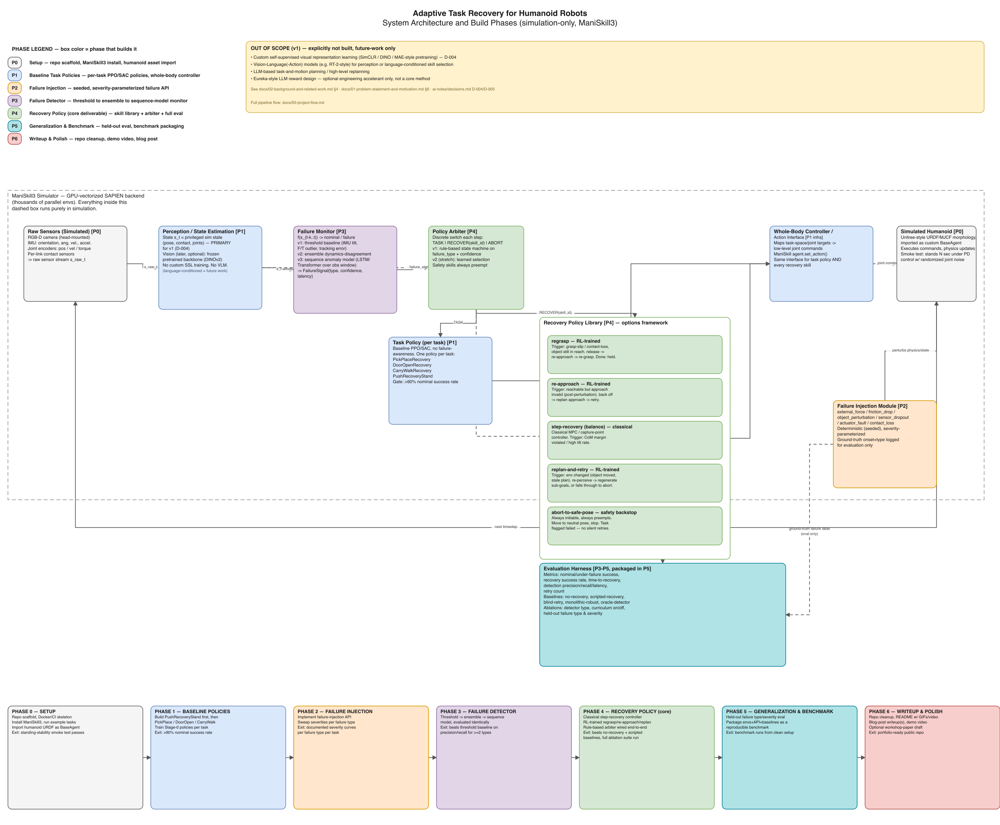

# Adaptive Task Recovery

Adaptive Task Recovery (ATR) is a learning-based framework for helping humanoid
robots detect task failures and recover autonomously. The project focuses on
failures such as slipped objects, missed grasps, unexpected contact, sensor
dropout, and loss of balance.

The system is designed to:

1. Detect when execution has departed from the expected task behavior.
2. Select an appropriate recovery strategy.
3. Return the robot to a state where it can resume the original task, or abort
   safely when recovery is not possible.

## Architecture diagram

The editable source is [`media/architecture-diagram.drawio`](media/architecture-diagram.drawio) — open it at [app.diagrams.net](https://app.diagrams.net) (File → Open From → Device) or with the draw.io VS Code extension to edit it. Box color = the phase (P0–P6) that builds that component; see [11-roadmap-and-milestones.md](docs/11-roadmap-and-milestones.md) for the full phase descriptions.

## Project scope

The project is simulation-only and targets tabletop manipulation and basic
standing-balance recovery. Policies will be trained and evaluated in
[ManiSkill](https://www.maniskill.ai/) using a simulated humanoid model.

Planned components include:

- Task policies for nominal behavior
- Failure injection for repeatable experiments
- Learned and threshold-based failure detectors
- A library of recovery policies
- A policy arbiter for task, recovery, and abort decisions
- Evaluation against no-recovery and scripted-recovery baselines

## Module layout

`src/atr/` is split into independently buildable packages, each owning one
design doc and talking to the others only through the `Protocol` contracts in
[`src/atr/interfaces.py`](src/atr/interfaces.py):

| Module | Owns | Design doc |
|---|---|---|
| [`envs/`](src/atr/envs/) | ManiSkill3 tasks + failure injection | [04-simulation-environment-maniskill.md](docs/04-simulation-environment-maniskill.md) |
| [`perception/`](src/atr/perception/) | State estimation (sim state now, frozen visual backbone later) | [03-system-architecture.md](docs/03-system-architecture.md) §2 |
| [`detection/`](src/atr/detection/) | Failure monitors (threshold → dynamics-ensemble → sequence model) | [06-failure-taxonomy-and-detection.md](docs/06-failure-taxonomy-and-detection.md) |
| [`recovery/`](src/atr/recovery/) | Recovery skill library + arbiter | [07-recovery-policy-design.md](docs/07-recovery-policy-design.md) |
| [`control/`](src/atr/control/) | Whole-body / action interface | [03-system-architecture.md](docs/03-system-architecture.md) §2 |

See each module's `README.md` for its status and what it depends on, or
[docs/05-project-flow.md](docs/05-project-flow.md) for the single-file map of
the whole runtime flow and build order.

## Current status

This project is in the planning and setup stage. The research questions,
architecture, training plan, evaluation strategy, and roadmap are documented in
the [`docs`](docs/) directory. See [STATUS.md](STATUS.md) for the current
status, active to-dos, and a log of recent changes.

## Roadmap

The main development phases are:

1. Set up ManiSkill and import a humanoid model.
2. Train baseline task policies.
3. Implement controlled failure injection.
4. Train and evaluate failure detectors.
5. Build recovery policies and the end-to-end system.
6. Package the benchmark, results, and demonstrations.

See the [full roadmap](docs/11-roadmap-and-milestones.md) for details.

## License

This project is licensed under the terms in [LICENSE](LICENSE).
