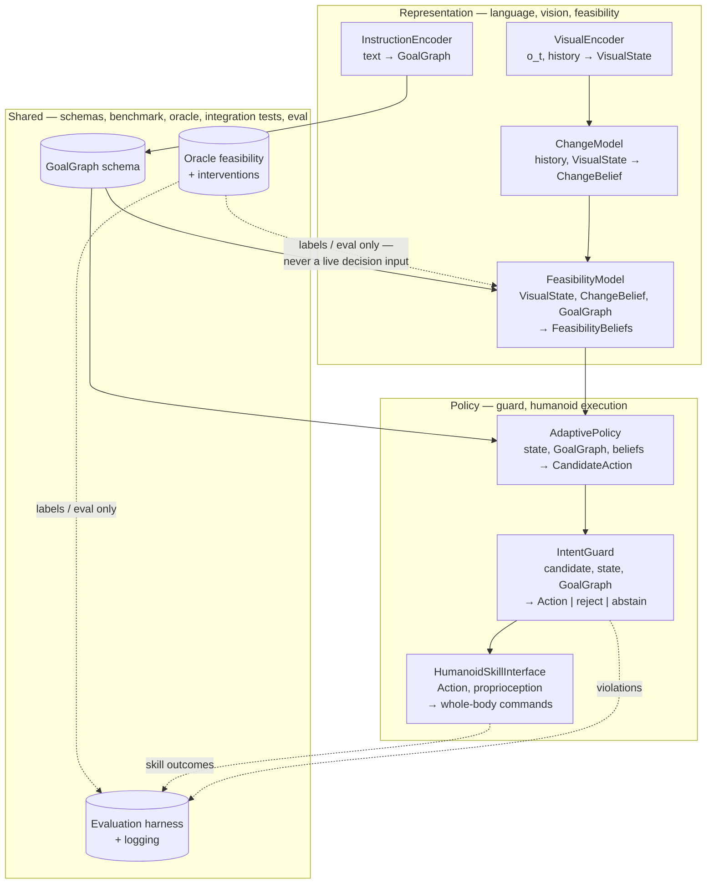

# System Architecture

**Redrawn 2026-08-02 (D-035):** the diagram below is the current,
authoritative architecture — module boundaries and ownership together,
matching the split in `docs/08-training-pipeline.md`'s "Contributors and
handoff contract". It replaces the old `media/architecture-diagram.drawio`
image, which described the pre-reframing humanoid-recovery architecture
and predates the current research question by a day (see
`media/README.md`); that image is kept only as historical reference and is
not linked from the README.

## Design principles

- Separate perception, feasibility estimation, policy adaptation, and intent
  checking so each research hypothesis is independently testable.
- Preserve temporal history: an irreversible change can be defined by the
  transition, not a single frame.
- Represent goals individually while retaining dependencies and hard constraints.
- Keep privileged simulator state out of agent observations; use it only for
  labeling, oracle baselines, and evaluation.
- Treat uncertainty explicitly and allow safe no-op or abstention when warranted.
- Isolate high-level feasibility reasoning from humanoid morphology and low-level
  control through a stable embodiment/skill interface.

## Modules

```text
VisualEncoder(o_t, history) -> VisualState
InstructionEncoder(text) -> GoalGraph(goals, constraints, priorities)
ChangeModel(history, VisualState) -> ChangeBelief
FeasibilityModel(VisualState, ChangeBelief, GoalGraph) -> FeasibilityBeliefs
AdaptivePolicy(state, GoalGraph, beliefs) -> CandidateAction
IntentGuard(candidate, state, GoalGraph) -> Action | reject | abstain
HumanoidSkillInterface(Action, proprioception) -> whole-body commands
```

## Module boundaries and ownership



Scope matches `docs/08-training-pipeline.md`'s contract exactly: the
representation area owns the `ObservationWindow + instruction ->
AgentBelief` path (encoders through feasibility), the policy area owns
`AgentBelief + available skills -> guarded SkillCall` (policy through
execution), and both share the shared row — schemas, benchmark, oracle,
integration tests, end-to-end evaluation. The dotted "labels / eval only" edges are the same design
principle stated above under "Design principles": privileged simulator
state feeds the oracle and evaluation paths, never the live
`FeasibilityModel`/`AdaptivePolicy` decision path.

Current implementation status (not shown above, changes faster than the
module diagram should): every module here has at least a toy-scale,
tested spike implementation in `spikes/task_schema_draft/` — see
`../ai-notes/status.md` for the up-to-date mapping and `ai-notes/decisions.md`
D-013–D-037 for what was actually built. The goal-graph/oracle-feasibility/
intent-guard core of `InstructionEncoder`, `FeasibilityModel`, and
`IntentGuard` moved into `src/atr/` 2026-08-02 (D-037) — see that
decision and `ai-notes/review-request-task-schema.md`'s status banner
before treating that as more settled than it is (self-resolved, not
independently reviewed). `VisualEncoder`, `ChangeModel`, `AdaptivePolicy`,
and `HumanoidSkillInterface` remain spike-stage in
`spikes/task_schema_draft/`, not yet promoted.

The `GoalGraph` captures goal predicates, dependencies, exclusions, priorities,
and hard constraints. Feasibility is probabilistic and per goal. The adaptive
policy may select a subgoal, choose a learned skill, or emit a primitive action.
The intent guard checks known hard constraints and disallowed substitutions.
The policy initially selects semantic skills such as navigate, reach, grasp,
place, inspect, or wait. A humanoid skill layer executes them while maintaining
balance and respecting kinematic/contact limits. Low-level skill failure is
reported back as evidence; it is not automatically equated with goal infeasibility.

## Data flow

1. Encode the instruction once and update visual state at every step.
2. Compare observation history with expected transitions to infer changes.
3. Estimate each unfinished goal's feasibility and uncertainty.
4. Select a strategy that maximizes weighted feasible-goal completion.
5. Reject or mask actions that violate explicit intent constraints.
6. Log predictions, decisions, violations, and oracle labels for analysis.
   **Real implementation 2026-08-04 (D-056, `src/atr/evaluation/logging.py`):**
   `build_episode_log()` combines a policy's own result dict (the
   `per_goal`/`goals_achieved`/`wasted_steps`/`*_violated` shape every
   policy in `atr.policies.baselines` and every pipeline already
   produces) with the `GoalGraph` it ran against and the episode's
   oracle labels into one structured, JSONL-persistable record.
   `atr.evaluation.harness.run_episode()`/`compare_policies()` take it as
   an opt-in `log_path`/`log_dir` — same derived-from-real-evidence
   discipline D-040 used for `AdaptivePolicy`: no field exists in the log
   that wasn't already being produced and just never attached to a
   record before.

## Initial interfaces

```python
class GoalSpec(Protocol):
    goals: tuple[Goal, ...]
    constraints: tuple[Constraint, ...]

class VisualEncoder(Protocol):
    def encode(self, observations: ObservationWindow) -> VisualState: ...

class FeasibilityEstimator(Protocol):
    def predict(self, state: VisualState, spec: GoalSpec) -> FeasibilityBeliefs: ...

class AdaptivePolicy(Protocol):
    def act(self, state: VisualState, spec: GoalSpec,
            beliefs: FeasibilityBeliefs) -> Action: ...

class IntentGuard(Protocol):
    def validate(self, action: Action, state: VisualState,
                 spec: GoalSpec) -> GuardDecision: ...

class EmbodimentInterface(Protocol):
    def available_skills(self, state: VisualState) -> tuple[SkillSpec, ...]: ...
    def execute(self, skill: SkillCall) -> SkillResult: ...
    def safe_stop(self) -> None: ...
```

**Aspirational when written, checked against real code 2026-08-02
(D-040) — and it didn't match.** `AdaptivePolicy`/`EmbodimentInterface`
imagined a stateful class-based interface. The real evidence, from four
independently-built, working env variants
(`spikes/task_schema_draft/policy_baselines*.py`), converged on
something simpler: a plain function,
`attempt_goal(env, goal, tray_slot_xyz) -> {"achieved": bool,
"steps_used": int, "skipped": bool}`, is the actual
embodiment/environment boundary — no `available_skills()`/`safe_stop()`
needed for anything built so far. `src/atr/policies/baselines.py`'s
`static_policy`/`feasibility_aware_policy`/`naive_substitution_policy`,
each parameterized by that function plus tray geometry, is the real,
working `AdaptivePolicy`-shaped interface today — not the pseudocode
above, which is kept here as a record of the original design intent, not
as a spec anything is checked against.

## Proposed repository layout

```text
src/atr/
├── envs/             # tasks, interventions, oracle feasibility labels
├── language/         # instruction schema, parsing, goal graphs
├── representations/  # self-supervised visual encoders and probes
├── feasibility/      # change and per-goal feasibility models
├── policies/         # static, adaptive, hierarchical, and oracle baselines
├── constraints/      # intent guard and violation monitors
├── control/          # humanoid skill adapters and whole-body safety interface
├── evaluation/       # metrics, splits, counterfactual tests
└── interfaces.py
configs/
scripts/
tests/
data/                 # manifests only; generated datasets ignored
docs/
ai-notes/
```

## Key ablation boundary

The primary comparison is modular explicit feasibility versus an otherwise
matched end-to-end adaptive policy. Modularization is a hypothesis, not an
assumed advantage; report if the monolithic baseline performs better.
