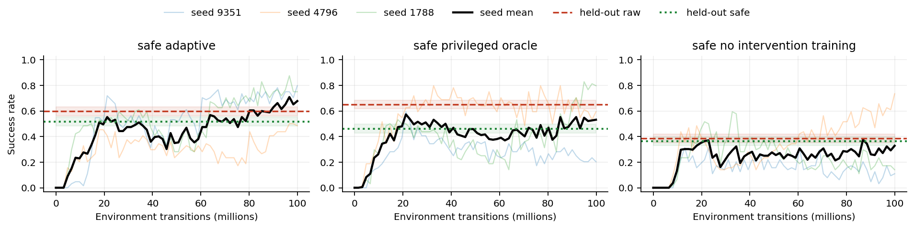
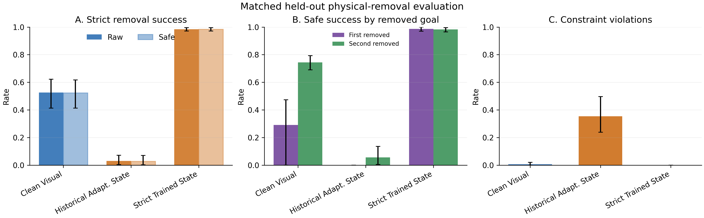

# Results and claim boundaries

> **Naming.** Counters here span the visual-controller and state-policy series
> and are not comparable across series. A counter is a later candidate, not a
> better one. See [`31-naming-and-identifier-key.md`](31-naming-and-identifier-key.md).

This is the validated index of results that passed their current validation
gate. It deliberately separates abstract skill selection from continuous robot
control. Confidence intervals are 95%; a point interval means the aggregate was
constant across the evaluated high-level split, not that uncertainty is absent.

## V41 three-seed canonicalization result

V41 (the magnitude-gated canonicalization controller) deploys the audited V40 (the audited canonicalization lineage) checkpoint lineage with one fixed magnitude gate.
It reaches 89.45% standard nominal, 95.57% standard intervention, and 96.35%
strict-removal safe success across three seeds. The minimum standard and strict
seed rates are 83.20% and 94.14%; pooled strict performance exactly matches the
V19 (the dual-specialist RGB controller) incumbent. Cyclic progress intervention produces positive paired effects
in both conditions: 11.07 points nominal [4.43, 19.79] and 13.15 points under
intervention [0.39, 23.18].

The untouched mean improves from V35's (the observed-domain canonicalization controller) 18.34% to 44.47%, but the frozen
all-domain rule is rejected. Synthetic geometric intervention cells reach
72.92%--82.03%; combined camera displacement reaches only 0.26% nominal /
10.81% intervention, and opposite-side lighting reaches 0% / 5.08%. The final
gate passes 6/10 checks. This supports preserved strict control, replicated
causal progress utility, and improved geometric transfer—not general visual
robustness. V41 uses privileged same-state supervision and supplies no
real-robot, pure self-supervised, or from-scratch RL evidence.

Two bounded follow-ups clarify the limitation. V42's (the unconstrained renderer-repair candidate) unconstrained renderer
repair crosses the clean route and collapses nominal/intervention to
50.39%/63.28%. V43 (the identity-protected renderer-repair candidate) restores retention to 91.02%/91.80% with stronger identity
protection, but reaches only 33.65% mean development OOD and 0% worst OOD.
Together they isolate a plasticity/invariance conflict in dense pixel
reconstruction: it can either alter clean controller inputs or preserve them
without undoing parallax and directional lighting. Neither follow-up received
multi-seed or untouched allocation.

## V35 observed-domain allocation result

The seed-1788 V35 (the observed-domain canonicalization controller) translation-repair smoke passes all seven frozen allocation
checks: 94.14% nominal and 96.09% intervention safe success, a 27.34-point
causal-progress drop [21.48, 33.20], +53.46-point mean observed-OOD improvement,
and 55.47% worst observed-OOD safe success. This authorizes the three-seed
confirmation chain; it does not itself establish multi-seed robustness. The
observed domains influenced model design, generic translations are supervised
training data, and V35 inherits privileged V34 (the dense spatial-warp candidate)/V19 (the dual-specialist RGB controller) supervision. Consequently
these numbers support only a development-gate claim, not pure self-supervised
learning, end-to-end RL, unseen-domain generalization, or real-robot transfer.

The subsequent three-seed confirmation rejects general V35 release. Standard
nominal/intervention safe success is 81.25%/89.19%, below both frozen 90%
thresholds, and the minimum standard seed is 73.83% versus an 80% floor. V35
does retain strict physical recovery: 91.54% pooled safe success, 82.81%
minimum seed, and a 4.82-point regression from V19 all pass. On the untouched
D-176 suite, mean unseen safe success is 18.34%, the worst pooled cell is 2.08%,
and at least one seed/domain is 0%. The causal-progress test remains positive,
but unseen robustness is rejected. The final gate passes 4/10 checks and V19
remains the incumbent.

## Frozen cross-embodiment adaptation benchmark

The v1 run contains 3,200 paired cases and 12,800 policy episodes across four
environment families. Oracle feasibility and static execution both achieve
1.68625 goals/case. Static execution uses 14.24 more wasted steps per paired
case (paired bootstrap interval 12.708--15.842). This supports a recovery
efficiency claim, not a higher-goal-recall claim.

The v1 safety columns are invalid because the evaluator originally read an
optional policy-specific field. The immutable v1 records remain preserved; no
safety result is taken from them.

## Corrected effect-aware safety benchmark

The v3 run contains 500 paired humanoid cases and 2,000 policy episodes. Every
policy is scored by the same final environment oracle.

| Policy | Goals/case | Wasted steps/case | Violations/case |
|---|---:|---:|---:|
| Static | 1.690 [1.650, 1.730] | 7.750 [6.750, 8.750] | 1.000 [1.000, 1.000] |
| Oracle feasibility | 1.690 [1.650, 1.730] | 1.550 [1.050, 2.100] | 0.752 [0.714, 0.790] |
| Unguarded substitution | 1.682 [1.642, 1.722] | 7.950 [6.950, 8.950] | 0.778 [0.742, 0.814] |
| Effect-aware guard | 1.000 [1.000, 1.000] | 0.000 [0.000, 0.000] | 0.000 [0.000, 0.000] |

The result exposes a safety/recall frontier: the guard blocks all observed
violations, but the current fixed bowl skill is predicted to move a protected
glass and there is no safe alternative skill. Feasibility alone is therefore
not a safety mechanism.

## Learned high-level policy diagnostic

These policies act through the benchmark's teleport-on-success executor. They
test decisions under held-out intervention mechanisms and must not be described
as learned physical manipulation.

| Policy | Training seeds | Test episodes | Goals | Wasted steps |
|---|---:|---:|---:|---:|
| Feasibility Q | 10 | 640 | 1.375 | 6.640625 |
| Behavioral cloning | 10 | 640 | 1.375 | 6.640625 |
| Privileged mechanism-ID Q | 10 | 640 | 0.000 | 0.000 |
| Blind domain-randomized Q | 10 | 640 | 1.000 | 0.000 |
| Scripted oracle feasibility | 0 | 64 | 1.375 | 6.640625 |
| Scripted static | 0 | 64 | 1.375 | 15.625 |

Feasibility Q and behavioral cloning match the scripted oracle means on this
split. The privileged mechanism-ID policy collapses on unseen identities,
while the blind policy sacrifices recall to avoid waste. This is evidence
about representation and reward behavior, not evidence of general robot skill.

## Integrated non-teleport Fetch recovery

This is the first experiment that combines the ATR components in one physical
episode rather than evaluating decision and manipulation tracks separately. A
parsed instruction requests the potted-meat can and cracker box while protecting
the master-chef can. The cracker is irreversibly removed during real can
execution. A fixed-camera RGB change score supplies feasibility, a physically
trained Q table chooses attempt/skip, the intent/navigation guard screens the
action, and `attempt_goal_with_real_grasp()` performs real navigation, IK,
contact-verified grasp, carry, and release. The module never imports the
teleport executor.

| Policy | Achievable can completion | Wasted steps | Violations |
|---|---:|---:|---:|
| Static | 0.633 [0.467, 0.800] | 461.6 [370.4, 552.9] | 0.000 [0.000, 0.000] |
| Privileged oracle | 0.600 [0.433, 0.767] | 191.6 [111.8, 271.4] | 0.000 [0.000, 0.000] |
| Visual learned + guard | 0.767 [0.600, 0.900] | 111.8 [47.9, 191.6] | 0.000 [0.000, 0.000] |

The RGB classifier is correct in 30/30 intervention episodes per policy and
the 90-record audit sums to zero teleport calls. Visual learned minus static
wasted steps is -349.9 with paired-bootstrap interval [-470.8, -226.8]. Its
destroyed-goal-only waste is 0.0 versus static's 285.9 [274.6, 297.3], which
isolates adaptation from stochastic failures of the shared can controller. Its
completion difference is +0.133 with interval [-0.100, +0.367], so completion
improvement is not claimed. Physical can outcomes are simulator-stochastic
even under paired seeds; this makes the efficiency result stronger than a
raw comparison of unpaired success percentages.

This closes the integration gap only at a hierarchical level. Perception is a
scene/object-calibrated frame-difference detector, the learned component is a
two-action high-level Q table, and the low-level motor skill remains scripted.
The destroyed second object means the experiment measures valid partial
completion, not two-object physical success.

## Integrated learned continuous-control recovery

`LearnedRecovery-v1` removes the hierarchy between recovery selection and motor
execution. A Panda policy acts only through continuous `pd_joint_delta_pos`
commands. It receives a factorized two-goal order, goal-progress memory, and
simulator state. A dynamic sweeper physically removes one requested cube with
applied force during the episode; the policy must complete the remaining
ordered feasible goals without displacing a protected yellow object. Pose
assignment is confined to randomized reset, and a runtime regression test
forbids `Actor.set_pose()` during task execution.

V6 (the clean learned-progress DAgger RGB controller) trains three matched PPO methods for exactly 99,942,400 transitions per
seed, three seeds each. Checkpoint selection uses only training-stream
validation and scores success minus twice the failure rate. Final evaluation
uses 256 disjoint held-out episodes per seed under intervention and another 256
per seed under the nominal condition. Methods share held-out seeds. The primary
endpoint is safe success: task success and no constraint violation at any time.

**Reward-audit correction (2026-08-28).** This V2/V6 cohort used a persistent
`3 * completed_goal_count` reward. At `gamma=0.95`, retaining one completed
goal could be worth more than terminal second-goal completion. A fresh
three-seed V2 audit subsequently produced 50.65% forced-intervention success
but only 1.95% nominal two-goal success over 768 episodes per condition. The
tables below remain immutable historical evidence about matched V2 policy
differences, but they are ineligible as final ordered-task or visual-recovery
claims. `LearnedRecovery-v3` corrects only the reward objective and reruns all
final state and RGB methods; no V2/V3 result is pooled or paired.

The vector version is [available as PDF](../media/results/learned-recovery-v6-curves.pdf).

| Method | Raw held-out success | Violation | Safe held-out success | Safe seed mean ± SD |
|---|---:|---:|---:|---:|
| **Adaptive PPO** | 459/768, 59.77% [56.26, 63.18] | 8.59% | **397/768, 51.69% [48.16, 55.21]** | 51.69 ± 15.24% |
| Privileged unavailable-state PPO | 500/768, 65.10% [61.67, 68.39] | 20.83% | 354/768, 46.09% [42.60, 49.63] | 46.09 ± 6.81% |
| No-intervention-training PPO | 295/768, 38.41% [35.04, 41.90] | 4.95% | 279/768, 36.33% [33.00, 39.79] | 36.33 ± 15.61% |

Paired effects over the same 768 intervention episodes are:

| Comparison | Raw-success difference | Safe-success difference |
|---|---:|---:|
| Adaptive − no-intervention training | +21.35 [17.32, 25.39] | **+15.36 [10.68, 20.05]** |
| Adaptive − privileged unavailable state | −5.34 [−9.51, −1.17] | **+5.60 [1.17, 10.03]** |

The raw/safe reversal against the privileged policy is not described as
adaptive dominance: privileged state yields more raw completions, while its
selected policies move the protected object more often. The constrained metric
prefers adaptive PPO because the experiment defines those runs as failures.

Branch stratification rules out the V2 shortcut in which success concentrated
almost entirely on second-goal removal:

| Removed goal | Adaptive safe success | No-intervention safe success | Paired difference |
|---|---:|---:|---:|
| First requested goal (hard recovery) | 33.24% [28.56, 38.27] | 0.00% [0.00, 1.06] | **+33.24 [28.49, 38.27]** |
| Second requested goal | 67.80% [63.13, 72.15] | 68.05% [63.39, 72.37] | −0.24 [−7.56, 7.07] |

The adaptive gain is isolated to the branch that requires abandoning the
unavailable first goal, while safe performance is unchanged when the nominal
prefix remains valid. Nominal safe success is 33.46% for adaptive, 37.24% for
privileged, and 0% for no-intervention training; none of these policies should
be presented as a solved two-object controller.

This is historical matched-policy evidence for H2, not the final corrected
same-task result. Observations are low-dimensional simulator state,
language is the factorized order encoding rather than open-vocabulary text,
the object set and intervention mechanism are narrow, adaptive safe success is
only 51.69%, and seed dispersion is substantial. The 8.59% adaptive violation
rate also means reward shaping plus termination does not replace the explicit
runtime guard validated elsewhere under H3.

Jarvis provenance: training array `1139059`, held-out evaluation array
`1139075`, and frozen-policy capture array `1139074` all completed with exit
code zero. Final repository validation array `1139068` completed 353 tests
across four deterministic disjoint shards with zero failures. The focused
runtime no-pose-assignment contract also passes 5/5 on the final synced tree.

## V3 restricted-RGB continuous-control screening result

The corrected V3 learned-progress controller completed three independent
training seeds at 39,993,344 PPO environment steps each, preceded by 1.92M
DAgger interactions per seed. Its deployed actor receives the 64×64 base-camera
RGB image, robot joint position/velocity and TCP pose, and the parsed two-token
instruction. It does not receive cube, goal, sweeper, protected-object, oracle
unavailability, or simulator goal-progress state. Object poses are used only
for the training-only asymmetric critic and auxiliary labels. Every executed
action is bounded continuous `pd_joint_delta_pos`; runtime teleport calls are
zero by construction and contract test.

Checkpoint selection used only training-stream evaluations. The frozen
`best.pt` policies were then evaluated on 256 disjoint deterministic episodes
per training seed and condition (768 each):

| Condition | Raw success | Safe success | Constraint violation | Hierarchical 95% interval (raw / safe) |
|---|---:|---:|---:|---:|
| Nominal two-object task | 748/768, 97.40% | 741/768, 96.48% | 0.91% | [95.96%, 98.70%] / [94.27%, 98.31%] |
| Forced sweeper target | 708/768, 92.19% | 699/768, 91.02% | 1.43% | [89.32%, 95.05%] / [87.63%, 94.53%] |

This is strong evidence that a restricted RGB policy can learn the physical
two-object controller without object-pose input. It is not yet a clean recovery
estimate. Only 125/768 intervention-condition episodes recorded recognized
physical unavailability; 119/125 succeeded and 118/125 were safe, but just
5/358 first-target episodes actually removed the first requested goal. The
controller often completed that goal before the step-18--36 sweeper arrived.
Conditioning on those 125 outcomes is also policy-dependent, so it cannot
replace a controlled recovery test. The 92.19% number is therefore labeled
forced-sweeper-condition success, not post-removal recovery. The separately
frozen step-0 stress test now supplies the recovery endpoint. The original
2 N, 12-step candidate failed closed because only 54/64 calibration episodes
contained recognized physical removal. A separate 64-episode calibration range
verified the selected 6 N, 24-step contact intervention at 64/64; the final seed
base was then changed to 82,000,000 so no calibration episode entered the
reported cohort.

All 768/768 final clean-visual episodes contain recognized physical removal.
The policy records 404 raw successes (52.60%), 402 safe successes (52.34%),
and five constraint violations (0.65%). These values may be reported as the
clean policy's strict-removal performance. They do not establish an adaptive
training benefit or visual/state parity; both matched comparisons remain
pending and use the same reset seeds.

The historical state recovery reference records 23/768 raw successes (2.99%),
22/768 safe successes (2.86%), and 272 violations (35.42%) under those same
strict seeds. Clean visual minus historical state is +49.61 percentage points
with paired hierarchical 95% interval [33.98, 61.59] raw, and +49.48 points
[33.98, 61.07] safe. The visual branch rates are sharply asymmetric: 109/374
(29.14%) when the first requested goal is physically removed and 295/394
(74.87%) when the second is removed.

The completed matched-distribution state control reverses that comparison.
Three from-scratch state-PPO seeds trained on the locked step-0, 6 N removal
distribution produce 756/768 raw and safe successes (98.44%; hierarchical 95%
interval [97.14%, 99.61%]) and zero violations. Safe success is balanced across
the first-goal-removed branch (369/374, 98.66%) and second-goal-removed branch
(387/394, 98.22%). Clean visual minus strict-trained state is −45.83 points raw
[−58.20, −35.55] and −46.09 points safe [−58.33, −36.20] on the identical 768
episode seeds. Thus the earlier visual-over-state result diagnoses distribution
shift, not an information advantage. It also establishes a demanding 98.44%
matched state baseline that the running V13 (the stabilized integrated RGB controller) visual extension must approach
while retaining nominal performance. This post-audit extension does not alter
the preregistered comparison.

That strict-trained state policy catastrophically fails the complementary
nominal endpoint: 0/768 raw and safe successes with 565/768 violations
(73.57%). Per-seed violations are 227/256, 82/256, and 256/256. Its 98.44%
strict result is therefore a condition-specialized ceiling, not an integrated
policy result. A V14 proposal to DAgger-distill this teacher was frozen before
the nominal audit, but its allocation gate required at least 70% nominal raw
and safe success with at most 5% violations. All three checks failed, so V14
training and every downstream evaluation were cancelled without consuming GPU
training time. This negative control strengthens the requirement to report
strict recovery and nominal retention for the same checkpoint.

The complementary nominal-only V3 state control is also not a usable expert.
After the same 100M requested transitions per seed, it obtains 145/768 nominal
raw successes (18.88%), 131/768 safe successes (17.06%), and 16/768 violations
(2.08%). Seed-level safe success is 0%, 4.30%, and 46.88%; all three seeds are
retained. This rules out presenting its best seed as a nominal upper bound or
using the pooled result as evidence that nominal state control is solved.

The fair privileged dual-regime comparator is therefore a separate state PPO
trained from scratch on the same frozen 80% strict-removal / 20% nominal
distribution and balanced 50/50 checkpoint-selection distribution as V13. It
uses the same seeds, event reward, safety terms, requested 100M-transition
budget, and separate 768-episode strict and nominal endpoints. All three tasks
in training array `1139751` completed at 99,942,400 floor-aligned transitions,
and checkpoint audit `1139752` verified three exact, finite checkpoint pairs.
Its frozen endpoints expose catastrophic nominal forgetting rather than an
integrated solution: strict physical-removal safe success is 748/768 (97.40%)
with 15/768 violations (1.95%), including 98.66% and 96.19% safe success when
the first and second goal is removed, but nominal raw and safe success are both
0/768 with zero violations. The six-check teacher gate therefore failed only
the >=90% nominal-safe requirement. Original strict array `1139753` failed
before evaluation because its submitted variable name did not match the batch
wrapper; no result was emitted. Provenance-preserving replacement `1140056`
used the same frozen config, checkpoints, seeds, 256 episodes/seed, and
evaluator, and completed all tasks with exit zero. State-only aggregate
`1139845` fed gate `1139804`, which failed closed and allocated no V15/V16
training.

The former V7 (the adaptive continuation controller)/V8 five-seed chain was cancelled before allocation because its
forced-sweeper endpoint rarely produced actual removal. The replacement
confirmation is gated on V13's separate strict and nominal held-out aggregates
and both strict removal branches. Only if all frozen eligibility checks pass do
seeds 71064 and 84293 retrain byte-identical V6 (the clean learned-progress DAgger RGB controller), V13, and integrated-state
tasks. Final aggregation requires all five seeds and 1,280 episodes per
condition; this post-audit extension cannot revise preregistered V1--V5.

The vector figure is [available as PDF](../media/results/strict-removal-state-training.pdf).

The auxiliary progress head is informative but incomplete: held-out balanced
accuracy is 74.16% nominal and 74.91% under intervention, driven by roughly 99%
negative recall but only 49--51% positive recall. A stricter identical-pixel
linear pose probe is negative. The learned encoder's mean variance-weighted R²
is 0.161 versus 0.339 for the untrained random encoder; learned minus random is
−0.177 with seed-bootstrap 95% interval [−0.334, −0.037]. Therefore the result
supports RGB control without hard-coded object poses, but does **not** support
a claim that the learned latent is a superior linear pose representation.

The preregistered V7 adaptive continuation completed all three exact
99,999,744-transition runs and frozen 768-episode endpoints. It retains 95.57%
nominal raw and 94.14% nominal safe success, but obtains only 33.20% raw and
32.42% safe success under actual physical removal, with 1.69% violations.
Strict seed-safe rates are 5.47%, 50.78%, and 41.02%. Clean-minus-V7 strict
safe success is +19.92 points with paired hierarchical 95% interval [−0.13,
48.83]; on the first-goal-removed branch V7 is 20.59% safe versus 29.14% clean.
The adaptive advantage required by V4 is therefore not confirmed.

V7's separate identical-pixel pose probe is positive: learned R² 0.725 versus
random 0.339, a +0.387 seed-level difference [0.312, 0.488], with all three
seed differences positive. This is not a pure temporal-SSL ablation: V7 also
uses privileged pose auxiliary targets and supervised learned-progress labels.
It supports linear pose decodability for this encoder, not a causal claim that
self-supervision produced the gain or that decodability improved strict
control. The matched V8/V9 control and representation endpoints are retained
for that attribution question.

The frozen direct RGB factorial is also complete. Across 768 nominal episodes,
symmetric RGB PPO obtains 2 raw/safe successes (0.26%), while asymmetric RGB
PPO and asymmetric+temporal RGB PPO each obtain 0. Their configured-
intervention safe rates are 42.71%, 43.23%, and 45.05%, respectively, which
does not rescue nominal competence. Consequently primary V1, V2, and V3 are
rejected. Combined with the strict V7 result, primary V4 is rejected as well.
Primary V5 is confirmed only against its preregistered historical state
reference (2.86% strict safe); the later distribution-matched strict state PPO
at 98.44% safe with zero violations is the mandatory competitive baseline and
prevents using V5 as a general competitiveness claim.

The stabilized V13 integrated RGB continuation completed three exact
99,999,744-step runs and passed the finite checkpoint/optimizer/provenance
audit. Its frozen nominal endpoint is 92.97% raw, 90.76% safe, and 2.47%
violations; strict actual-removal is 90.89% raw, 89.71% safe, and 1.17%
violations. First-/second-goal-removed safe success is 83.69%/95.43%. It
therefore fails the immutable integrated gate by 0.29 points on strict safe and
1.31 points on the first-removal branch; no five-seed allocation occurred.
This is the strongest single restricted-RGB integrated result so far, but it is
not labeled eligible or competitive.

V13's matched-pixel pose probe is neutral: learned-minus-random R² −0.003
[−0.247, 0.203]. Its separate ordered goal-resolution probe is positive on all
three seeds: balanced-accuracy gain +0.044 [0.040, 0.050], ROC-AUC gain +0.019
[0.007, 0.029], and R² gain +0.228 [0.131, 0.344]. Because the policy receives
supervised progress labels during training, this supports task-semantic linear
decodability, not a pure self-supervised or causal representation claim.

The failure-only strict-initialized state continuation reaches 92.58% strict
safe success, 91.18%/93.91% branch safe, and 0.91% violations, but again scores
0/768 nominal. Its frozen gate failed only nominal safety. The router artifact
then released the post-hoc V19 (the dual-specialist RGB controller)/V20 (the full-strength VICReg ablation) dual-specialist RGB pair, which uses nominal
RGB and strict state specialists only as disclosed training-time teachers.

V19 subsequently completed three exact 99,999,744-step seeds and its immutable
checkpoint audit. On 768 held-out episodes per regime it reaches 97.66% raw and
96.35% safe strict success with 1.30% violations, and 94.66% raw and 91.41%
safe nominal success with 3.65% violations. Safe success is 97.06% when the
first goal is physically removed and 95.69% when the second is removed. It
passes all six frozen selector checks and improves the integrated worst
endpoint from V13's 83.69% to 91.41%. This supports a competitive non-teleport
restricted-input visual-control claim within this benchmark. It does not show
state-upper-bound parity (strict V11 (the strict-trained state PPO specialist): 98.44% safe, zero violations), pure pixel
RL, pure self-supervision, real-robot transfer, or cross-method superiority:
V19 uses privileged dual teachers, progress labels, and an asymmetric critic
during training, and its fixed new-seed confirmation remains in progress.

The post-selection V19 causal/OOD suite contains 16,896 paired policy episodes.
Cyclically shifting only its predicted progress bits reduces intervention safe
success from 96.22% to 81.90%, a 14.32-point paired drop with cluster-bootstrap
95% interval [0.65, 29.69]. This passes the frozen causal-utility rule and shows
that the controller functionally uses the learned head rather than carrying an
unused auxiliary predictor. Frozen visual-OOD robustness is rejected: 4-pixel
translation and +5 cm camera height reduce intervention safe success to 5.08%
and 2.86%, and every tested pixel, color, lighting, or camera variant fails the
joint 75%-safe / at-most-15-point-drop rule. V19's primary result is therefore
conditional on the declared camera and appearance distribution; this suite is
simulation-only and supplies no real-world robustness evidence.

Jarvis provenance: training `1139383` and held-out evaluation `1139384`
completed with exit code zero. Original aggregate `1139385` rejected the
correct floor-aligned PPO budget because of a verifier rounding defect;
corrected aggregate `1139553` consumed the same immutable six evaluation files
and completed with exit code zero. The 70% competence gate passed at 97.40%
nominal raw success, releasing the matched adaptive experiment.

## Continuous non-teleport manipulation

Three-seed, 50M-transition PPO runs use ManiSkill's official task-specific
parallelization settings for PickCube-v1, randomized PickSingleYCB-v1, and
UnitreeG1PlaceAppleInBowl-v1. Each result below uses the best checkpoint chosen
only by training-stream evaluations, then a deterministic evaluation on 256
episodes per seed whose seeds are disjoint from training and checkpoint
selection. The pooled interval is a 95% Wilson interval over 768 held-out
episodes; seed dispersion is sample standard deviation across three rates.

| Task | Held-out successes | Pooled success | Seed mean ± SD |
|---|---:|---:|---:|
| PickCube-v1 | 755/768 | 98.31% [97.13%, 99.01%] | 98.31% ± 0.90% |
| PickSingleYCB-v1 | 530/768 | 69.01% [65.65%, 72.18%] | 69.01% ± 4.30% |
| UnitreeG1PlaceAppleInBowl-v1 | 767/768 | 99.87% [99.27%, 99.98%] | 99.87% ± 0.23% |

All nine training jobs reached their batch-aligned budgets (49,954,816 for
PickCube, 49,938,432 for PickSingleYCB, and 49,971,200 for G1), all nine
checkpoint-continuation checks exited successfully, and all nine held-out
evaluations reported every requested success trial. The G1 runs use an
explicit 256 MiB PhysX collision stack; their complete native logs contain
zero overflow diagnostics. Partial 4 MiB, 16 MiB, and 64 MiB G1 runs are
quarantined and excluded. The latest full repository validation is 353 passed
and zero failed across four deterministic, disjoint test-file shards.

These standard-task results establish learned continuous manipulation without
ATR's teleport executor. The separate integrated Fetch result above establishes
hierarchical adaptation, but these PPO checkpoints themselves do not establish
adaptation after irreversible changes, language conditioning, or transfer to
the Fetch ReplicaCAD task. Exact numerical ranking against ManiSkill's published
curves is also avoided because this run uses the readable PPO implementation,
a separately declared held-out protocol, and no CUDA-graph optimization.

The separate Fetch ReplicaCAD controller physically grasps, carries, and places
the can in 10/10 sequential episodes. Its current scripted bowl grasp fails in
10/10, giving 1.0/2.0 mean goals, 0/10 complete tasks, and zero constraint
violations. A 69-candidate position/approach/torso sweep produced zero
contact-verified grasps and zero retained lifts. A separate 12-candidate 6-DoF
diagnostic could not reach its requested orientations and is not counted as a
valid grasp test. The position sweep rejects the tested scripted grasp family;
it is not a proof that the Fetch embodiment can never grasp the bowl. Standard
ManiSkill PPO success does not imply transfer to that Fetch scene or solve the
full ATR physical task.

## Comparison rule

Related systems use different embodiments and task definitions. Compare ATR to
SayCan, Inner Monologue, KnowNo, and shielding by capability and assumptions as
documented in [02-background-and-related-work.md](02-background-and-related-work.md).
Use numerical ranking only for policies evaluated on the same ATR cases or the
same held-out ManiSkill protocol.
